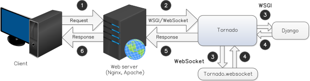

.. Django-tornado-websockets documentation master file, created by
   sphinx-quickstart on Wed May  4 14:40:21 2016.
   You can adapt this file completely to your liking, but it should at least
   contain the root `toctree` directive.

Django-tornado-websockets's documentation
=========================================

Django-tornado-websockets is a useful solution to provide an easy way to use
`Tornado WebSockets <http://www.tornadoweb.org/en/stable/websocket.html>`_ with a
`Django <https://www.djangoproject.com/>`_ application.

.. Important::
   Django-tornado-websockets is actually in **alpha version**!

-------------------------------------------------------------------------------

Architecture
------------

   Example of an architecture using Tornado as WSGI server, Django and django-tornado-websockets

To use django-tornado-websockets's WebSockets, you should use **Tornado as a WSGI server** where you will define
handlers to *handle* an incoming request. Since we already have a WSGI server, it's probably useless to try running
`Gunicorn <http://gunicorn.org>`_ or `uWSGI <http://uwsgi-docs.readthedocs.io/en/latest/>`_ as WSGI server.
You can try to wrap Tornado **WSGI server** into Gunicorn/uWSGI **WSGI server** but... It's a bit retarded I think
``(・_・ヾ``...

Let's explain this diagram:

1. The client make a request to our web server with his web browser,
2. Our web server (`nginx <http://nginx.org>`_, `Apache <https://httpd.apache.org>`_, ...) pass this WSGI or WebSocket request to Tornado [#f1]_,
3. If it is a *WebSocket request*, we pass it to ``tornado.websocket``, otherwise it's Django that will handle this request,
4. We wait for a *WebSocket response* or a Django response,
5. and 6. Then we return this response to the client.

.. [#f1] I forgot it on the diagram, but nginx or Apache has the job to deliver static files, it's not Tornado's work

-----------------------------------------------------------------------------------------

Documentation
-------------

.. toctree::
   :maxdepth: 3
   :numbered:

   installation
   django_integration_configuration
   usage
   api
